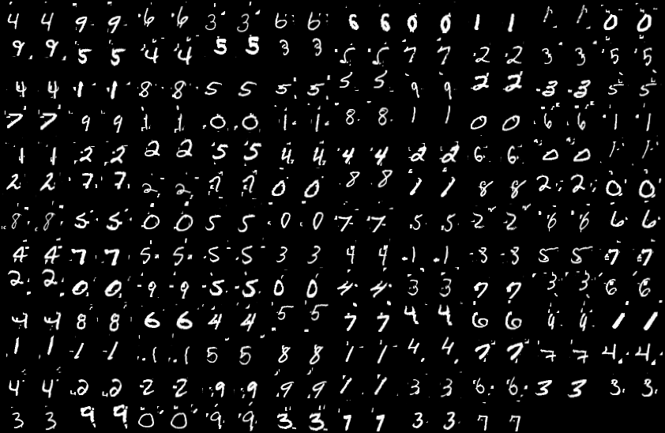

#Tpatial-Transformer-Networks-pytorch
- Refer to [daviddao/spatial-transformer-tensorflow](https://github.com/daviddao/spatial-transformer-tensorflow)(Tensorflow) .
- Implementation of [**Spatial Transformer Networks**](https://arxiv.org/abs/1506.02025).  

## Statement
- Do the Experiments on the **cluttered MNIST** dataset of [daviddao](https://github.com/daviddao/spatial-transformer-tensorflow).
- The accuracy and loss records can be find in **cnn.out & stn.out**.
- The transform img can be find in **transform_img/**.

## Environment
- python3.5
- pytorch '0.2.0+eed323c'

## Accuracy
**CNN**

- ========= Testing: epoch[195/200] loss:0.5183 acc:0.9188
- ========= Testing: epoch[196/200] loss:0.5136 acc:0.9208
- ========= Testing: epoch[197/200] loss:0.5165 acc:0.9167
- ========= Testing: epoch[198/200] loss:0.4953 acc:0.9182
- ========= Testing: epoch[199/200] loss:0.5040 acc:0.9249

**STN**

- ========= Testing: epoch[195/200] loss:0.1682 acc:0.9613
- ========= Testing: epoch[196/200] loss:0.1538 acc:0.9635
- ========= Testing: epoch[197/200] loss:0.1501 acc:0.9628
- ========= Testing: epoch[198/200] loss:0.1351 acc:0.9646
- ========= Testing: epoch[199/200] loss:0.1398 acc:0.9657

## Transform Image
**Not sure why the transform image looks strange... I use torchvision.utils to save image.**
(input|transform|input|transform)

